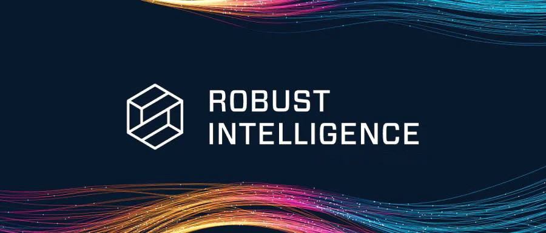

  

 

  

<h1 align="center">Robust Intelligence ($ROBUST)</h1>

> 🧠 AI is powerful — but vulnerable.  
> Robust Intelligence is building the security layer that AI never had.
  

  AI Security Infrastructure built on Solana

---

## 🚀 Introduction
...

Robust Intelligence is a next-generation AI security project focused on protecting artificial intelligence systems from emerging threats. As AI adoption accelerates across industries, the risks surrounding model integrity, data manipulation, and system exploitation are growing rapidly.

Our mission is to build a secure, scalable, and decentralized infrastructure that ensures AI systems remain trustworthy, resilient, and protected in real-time.

---

## ❗ Problem
...

AI systems today are powerful — but fragile.

They can be:
- Manipulated by adversarial inputs  
- Corrupted during training (data poisoning)  
- Exploited through vulnerabilities  
- Controlled by centralized systems  

Without security, AI becomes a risk — not a solution.
---

## 💡 Solution
...

Robust Intelligence introduces a decentralized AI security layer built on Solana.

We provide:

- Real-time threat detection for AI systems  
- Continuous monitoring of model behavior  
- Protection against manipulation and exploits  
- Decentralized infrastructure for transparency  
- Scalable and high-speed security powered by Solana  

Our system is designed to act as a protective shield for AI.

---

## 🔥 Key Features
...

### 🔐 Real-Time AI Protection
Detect and respond to threats instantly.

### 🛡️ Model Integrity Security
Ensure AI models are not altered or exploited.

### 🌐 Decentralized Security Layer
Remove single points of failure.

### ⚡ High Performance
Built on Solana for speed and scalability.

### 🧠 Adaptive Defense System
Evolves to handle new threats.

## ⚙️ Technology
...

Robust Intelligence combines:

- AI-based threat detection models  
- Behavioral monitoring systems  
- Blockchain verification layer (Solana)  
- Secure data pipelines  
- Future integration with on-chain validation  

---

## 🧩 Architecture
...

 mermaid
flowchart LR
    A[AI Model] --> B[Threat Detection Engine]
    B --> C[Monitoring System]
    C --> D[Security Layer]
    D --> E[Solana Blockchain]
    E --> F[Verification]
    F --> B

## 🪙 Token Overview
...

- Token Name: Robust  
- Symbol: $ROBUST  
- Network: Solana  
- Type: Utility Token  

### Token Utility

$ROBUST will be used for:

- Accessing AI security services  
- Paying for protection layers  
- Governance participation  
- Incentivizing network contributors  
- Future staking mechanisms  

---

## 🌍 Use Cases
...

- AI platforms requiring security protection  
- Web3 AI applications  
- Enterprises deploying AI systems  
- Developers building AI models  
- Data-sensitive AI environments  

---

## 👁️ Vision
...

To become the global security layer for AI systems.

We aim to create a future where:
- AI is secure by default  
- Systems are protected in real-time  
- Trust in AI is no longer a concern  

---

## 🗺️ Roadmap
...

### Phase 1
- Concept development  
- Branding and identity  
- Initial community setup  

### Phase 2
- Social growth  
- Awareness campaign  
- Early supporters onboarding  

### Phase 3
- Token launch ($ROBUST)  
- Listing on platforms  
- Initial partnerships  

### Phase 4
- Product development  
- AI security engine prototype  
- Testing environment  

### Phase 5
- Full ecosystem launch  
- Integration with AI platforms  
- Expansion and scaling  

---

## ⚡ Why Solana?
...

Solana provides:

- High-speed transactions  
- Low fees  
- Scalability for real-time systems  
- Strong ecosystem for Web3 projects  

This makes it ideal for AI security infrastructure.

---

## 🤝 Community
...

We are building a strong and early community.

Stay connected:

- Twitter: https://x.com/robusthq  
- Website: Website: Coming soon
- Docs: Coming soon  

---

## 📄 Whitepaper
...

Read our full documentation here:  
👉 [Download Whitepaper](docs/robust_whitepaper.pdf)

---

## 🧠 What Makes Robust Different?
...

- Not just AI — focused on AI security  
- Not centralized — built on Solana  
- Not reactive — real-time protection system  
- Not generic — designed for AI-native threats  

---

## 🔮 Future Vision
...

We believe AI will power everything.

But without security:
- AI cannot be trusted  
- Systems can be manipulated  
- Data becomes a liability  

Robust Intelligence aims to become:
👉 The default security layer for all AI systems.

---

## 🚀 Join Us Early
...

We are building from the ground up.

Be early. Be part of the future.

Follow us and stay updated.

---

## Disclaimer

This project is in early-stage development.  
Details may evolve as the project grows.

---

## Final Note

AI is the future.  
Security will define that future.  

Robust Intelligence is building the foundation.
