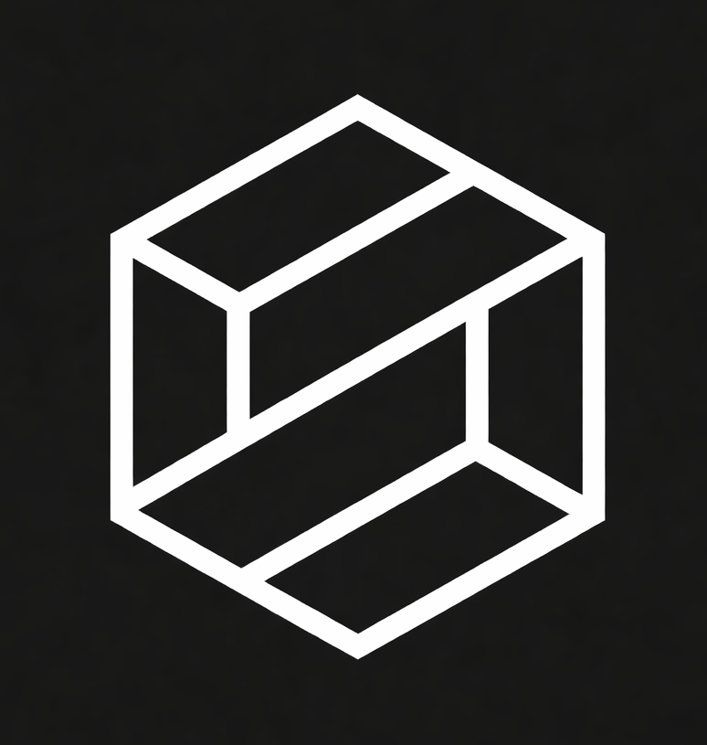

  

# Robust Intelligence ($ROBUST)

AI Security Infrastructure built on Solana.

---

## Introduction

Robust Intelligence is a next-generation AI security project focused on protecting artificial intelligence systems from emerging threats. As AI adoption accelerates across industries, the risks surrounding model integrity, data manipulation, and system exploitation are growing rapidly.

Our mission is to build a secure, scalable, and decentralized infrastructure that ensures AI systems remain trustworthy, resilient, and protected in real-time.

---

## Problem

Modern AI systems face critical vulnerabilities:

- Model manipulation and adversarial attacks  
- Data poisoning during training  
- Unauthorized access to AI systems  
- Lack of real-time monitoring and defense  
- Centralized control with single points of failure  

As AI becomes more powerful, these risks become more dangerous.

---

## Solution

Robust Intelligence introduces a decentralized AI security layer built on Solana.

We provide:

- Real-time threat detection for AI systems  
- Continuous monitoring of model behavior  
- Protection against manipulation and exploits  
- Decentralized infrastructure for transparency  
- Scalable and high-speed security powered by Solana  

Our system is designed to act as a protective shield for AI.

---

## Key Features

### 1. Real-Time AI Protection
Detect and respond to threats instantly as they occur.

### 2. Model Integrity Security
Ensure AI models are not altered, corrupted, or exploited.

### 3. Decentralized Security Layer
Remove single points of failure using blockchain technology.

### 4. High Performance
Built on Solana for fast, low-cost, and scalable operations.

### 5. Adaptive Defense System
Continuously evolves to handle new attack vectors.

---

## Technology

Robust Intelligence combines:

- AI-based threat detection models  
- Behavioral monitoring systems  
- Blockchain verification layer (Solana)  
- Secure data pipelines  
- Future integration with on-chain validation  

---

## Token Overview

- Token Name: Robust  
- Symbol: $ROBUST  
- Network: Solana  
- Type: Utility Token  

### Token Utility

$ROBUST will be used for:

- Accessing AI security services  
- Paying for protection layers  
- Governance participation  
- Incentivizing network contributors  
- Future staking mechanisms  

---

## Use Cases

- AI platforms requiring security protection  
- Web3 AI applications  
- Enterprises deploying AI systems  
- Developers building AI models  
- Data-sensitive AI environments  

---

## Vision

To become the global security layer for AI systems.

We aim to create a future where:
- AI is secure by default  
- Systems are protected in real-time  
- Trust in AI is no longer a concern  

---

## Roadmap

### Phase 1
- Concept development  
- Branding and identity  
- Initial community setup  

### Phase 2
- Social growth  
- Awareness campaign  
- Early supporters onboarding  

### Phase 3
- Token launch ($ROBUST)  
- Listing on platforms  
- Initial partnerships  

### Phase 4
- Product development  
- AI security engine prototype  
- Testing environment  

### Phase 5
- Full ecosystem launch  
- Integration with AI platforms  
- Expansion and scaling  

---

## Why Solana?

Solana provides:

- High-speed transactions  
- Low fees  
- Scalability for real-time systems  
- Strong ecosystem for Web3 projects  

This makes it ideal for AI security infrastructure.

---

## Community

We are building a strong and early community.

Stay connected:

- Twitter: https://x.com/robusthq  
- Website: https://robustintelligence.com/
- Docs: Coming soon  

---

## Disclaimer

This project is in early-stage development.  
Details may evolve as the project grows.

---

## Final Note

AI is the future.  
Security will define that future.  

Robust Intelligence is building the foundation.
